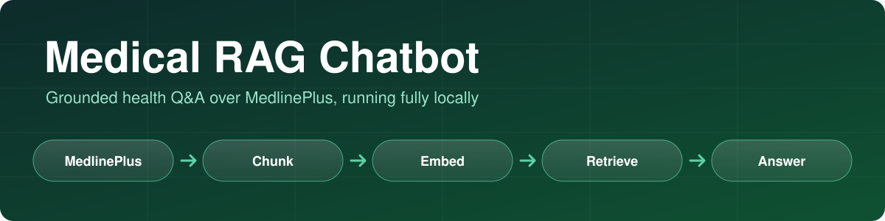
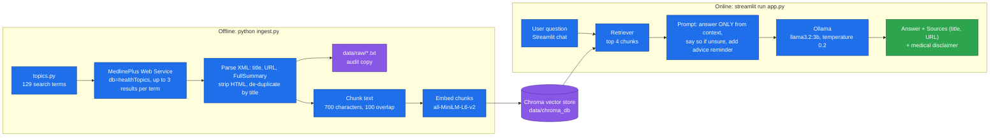

<p align="center">
  
</p>

<p align="center">
  
  
  
  
  
  
</p>

# Medical RAG Chatbot

**A Retrieval-Augmented Generation chatbot that answers general health questions using only content from [MedlinePlus](https://medlineplus.gov), and shows the source pages under every answer.**

The health content is fetched once from the official MedlinePlus Web Service. After that, embeddings and the language model both run on your own machine (sentence-transformers and Ollama), so there are no paid APIs and no API keys.

> **Educational project, not a medical device.** The app shows a standing disclaimer, and the prompt tells the model to answer only from the retrieved context and to remind users to consult a healthcare professional.

---

## Key features

- **Grounded answers**: the prompt restricts the model to the retrieved MedlinePlus context and tells it to say so when the context is not enough, instead of guessing.
- **Source citations**: every answer lists the titles and links of the pages it was built from, with duplicates removed.
- **Curated knowledge base**: 129 search terms in `topics.py` (chronic conditions, cardiovascular, and more), each queried against MedlinePlus and de-duplicated by title.
- **Auditable data**: every fetched topic is also saved as a plain `.txt` file in `data/raw/`, so you can see exactly what the bot knows.
- **Runs locally**: `all-MiniLM-L6-v2` embeddings, a local Chroma vector store, and an Ollama model.
- **Simple chat UI**: Streamlit chat with history, a Sources expander, a Clear chat button, and error handling if the vector store or Ollama is missing.

---

## Architecture



### How a question is answered

1. The question is embedded with the same model used at ingestion and matched against the Chroma store.
2. The four most similar chunks are joined into the prompt as context.
3. The Ollama model answers with a low temperature (0.2).
4. The app displays the answer and the unique source pages of the retrieved chunks.

The chain is built with LangChain's expression language (`RunnableParallel` and `RunnablePassthrough`) so the retrieved documents flow through to the UI as sources.

---

## Tech stack

| Layer | Choice |
|---|---|
| Orchestration | LangChain |
| Data source | MedlinePlus Web Service (U.S. National Library of Medicine) |
| Embeddings | `sentence-transformers/all-MiniLM-L6-v2` |
| Vector store | ChromaDB (persisted locally) |
| LLM | Ollama, default `llama3.2:3b` |
| UI | Streamlit |

## Project structure

```
RAG/
├── app.py            # Streamlit chat UI
├── rag_chain.py      # retriever + prompt + Ollama chain, source extraction
├── ingest.py         # MedlinePlus fetch, clean, chunk, embed, persist
├── topics.py         # the 129 health search terms
├── requirements.txt
├── docs/banner.svg
└── data/             # created by ingest.py (git-ignored)
    ├── raw/          # one .txt per fetched topic
    └── chroma_db/    # the vector store
```

---

## Setup

Requires Python 3.9 or newer and [Ollama](https://ollama.com).

```bash
git clone https://github.com/talha142/RAG.git
cd RAG

python -m venv venv
source venv/bin/activate          # Windows: venv\Scripts\activate
pip install -r requirements.txt
```

**1. Pull a model with Ollama** (make sure Ollama is running):

```bash
ollama pull llama3.2:3b
```

**2. Build the vector store** (needs internet access to MedlinePlus; the first run also downloads the embedding model):

```bash
python ingest.py
```

**3. Start the app:**

```bash
streamlit run app.py
```

## Configuration

| What | Where | Default |
|---|---|---|
| Health topics to ingest | `HEALTH_TOPICS` in `topics.py` (re-run `ingest.py` after editing) | 129 terms |
| LLM model | `OLLAMA_MODEL` in `rag_chain.py` | `llama3.2:3b` |
| Chunks retrieved per question | `TOP_K` in `rag_chain.py` | 4 |
| Chunk size and overlap | `CHUNK_SIZE`, `CHUNK_OVERLAP` in `ingest.py` | 700 / 100 |
| Embedding model | `EMBEDDING_MODEL` in `ingest.py` and `rag_chain.py` (keep both the same) | `all-MiniLM-L6-v2` |
| Prompt and tone | `PROMPT_TEMPLATE` in `rag_chain.py` | context-only, with advice reminder |

Any model you have pulled in Ollama works, for example `mistral` or `llama3.1:8b`. A larger model usually answers better but needs more memory.

## Example questions

- What is type 2 diabetes?
- What are the symptoms of hypothyroidism?
- How is high cholesterol managed?

## Limitations

- **Coverage**: the bot only knows the topics listed in `topics.py`, using MedlinePlus topic summaries. Anything outside them should get an "I don't have enough information" reply, but that depends on the model following the prompt.
- **Answer quality depends on the local model**, and small models can still paraphrase inaccurately. Check the cited sources.
- **General information only**: no diagnosis and no personalization. There is no conversation memory either: each question is answered independently, and the chat history is only displayed.
- If some topics return no results during ingestion, adjust their search term in `topics.py`.
- Some LangChain imports used here (`langchain_community`) are being replaced by dedicated packages in recent LangChain releases, so you may see deprecation warnings.
- There is no automated evaluation or test suite yet.

## Data source and attribution

All content comes from MedlinePlus, a public consumer health resource of the U.S. National Library of Medicine. Each answer links back to the MedlinePlus pages it used.

## Future improvements

- Add an evaluation set of health questions with expected sources, and measure retrieval quality.
- Move to the dedicated `langchain-chroma`, `langchain-huggingface` and `langchain-ollama` packages.
- Use conversation history when retrieving follow-up questions.
- Add a screenshot or short demo GIF of the chat UI.
